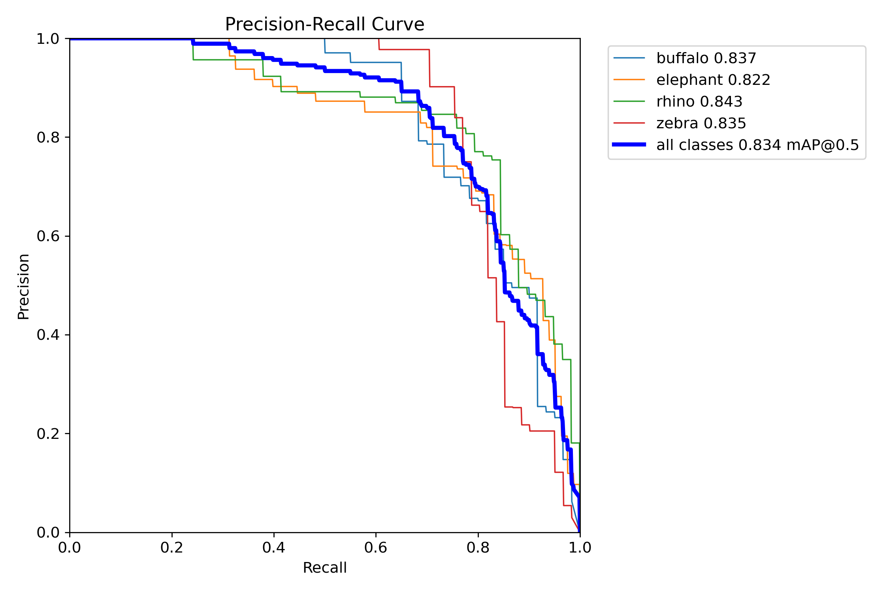
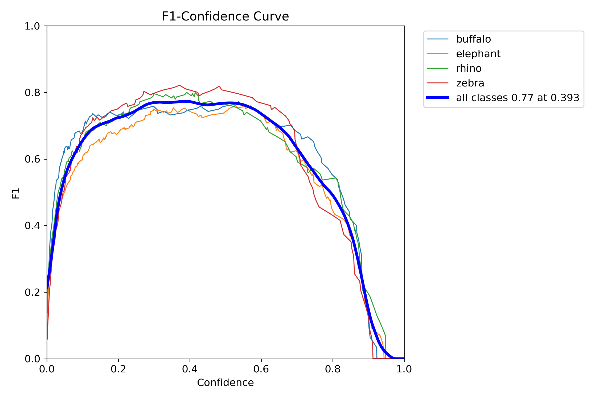
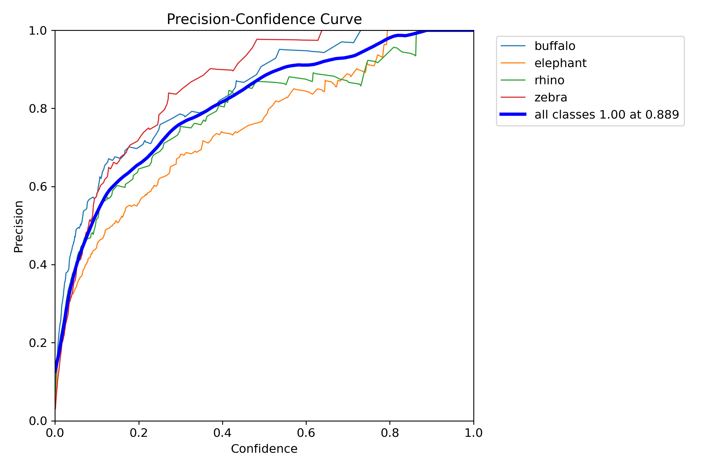
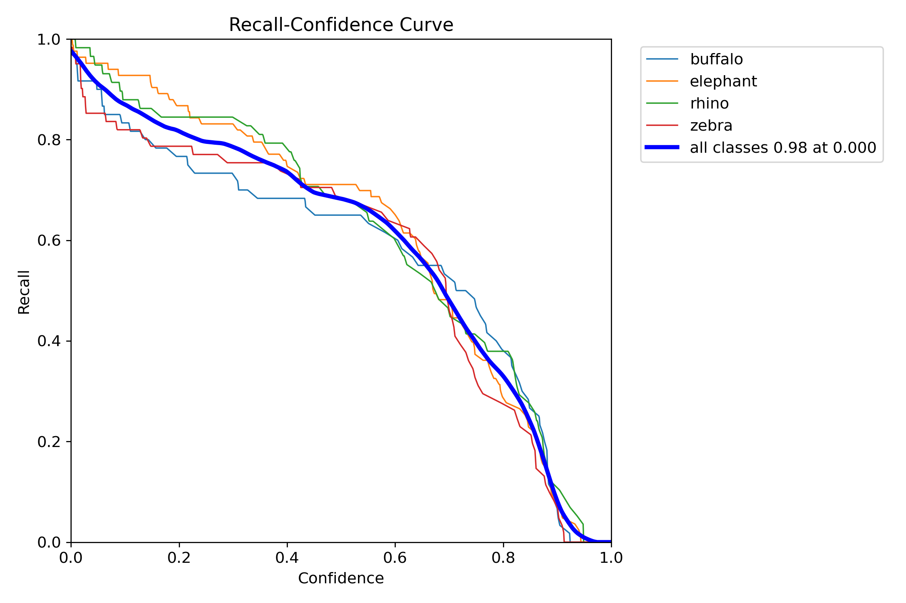

## Wildlife tracker

Wildlife are a very important factor in our ecosystem as they help balance natural ecosystems. They also offer revenues for many countries through tourist attraction sites, game drives and conservation hubs. One problem evident is how sometimes the ever changing climate sometimes drives them out from the forests thereby resulting into human-wildlife conflict. This often results into destruction of property and loss of human life in some instances. 

## Training

Training deep learning models for wildlife tracking on CPUs can be time-consuming. Utilizing `GPUs`, such as those provided by `Google Colab`, is essential for efficient training. Models will be trained on GPUs and later saved for deployment using torch on CPUs. This documentation[https://pytorch.org/tutorials/beginner/saving_loading_models.html] comes in handy to understand loading of `GPU` trained models on the `CPU`.

The optimum epochs used for training that saw an improvement in the `precision`, `recall` and `F1` scores was 25. It is more evident 

The chosen metrics seem to be improving with every iteration as evident in the  and . 

The  and  curves independently also show the same characteristic in the combined curve. 

## Deployment 

The saved model weights will be deployed using `Streamlit` because of its simple UI. The saved model can also be deployed on **Neural magic**. 

The optimum model weights used in the training stage to improve the `precision` and `recall` scores using the `GPUs` can be found [here](train6/weights). 

## Future steps

Deploy the model on the **Neural Magic** platform because of its scalability properties and efficiency in handling large volumes of data. As this is a deep learning model, deploying it uisng **Neural magic** in future will offer the efficiency required. 